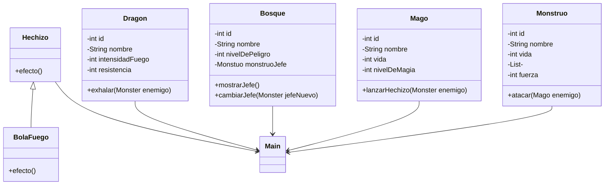
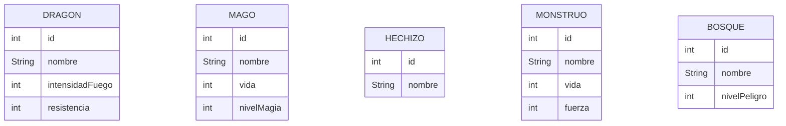

# Dragolandia
## Introducción
Proyecto implementado en Java que gestiona la interacción entre las clases mago, monstruo y bosque para simular peleas en un videojuego. 
## Análisis
#### Diagrama de clases

## Diseño
#### Diagrama entidad relación

###  