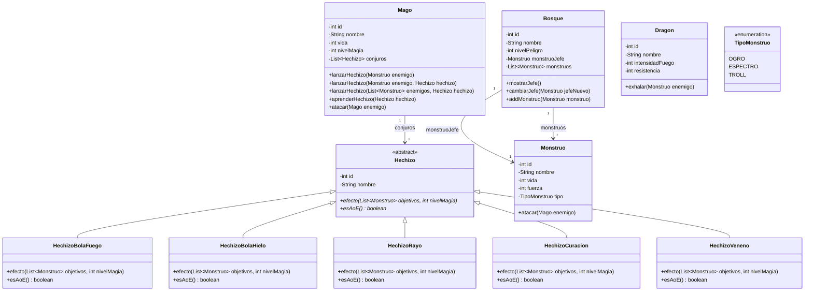
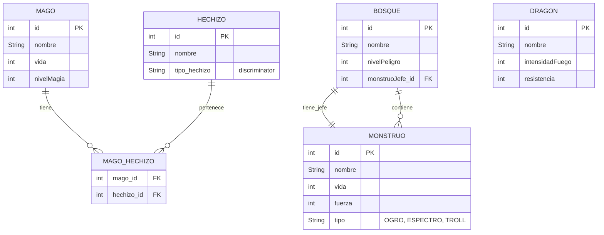
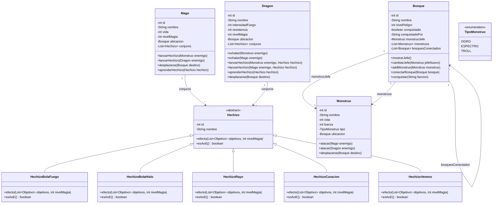

# Dragolandia
## Introducción
Proyecto implementado en Java que gestiona la interacción entre las clases mago, monstruo y bosque para simular peleas en un videojuego. 
## Análisis
#### Diagrama de clases

```mermaid
classDiagram
   Hechizo <|-- HechizoBolaFuego
   Hechizo <|-- HechizoBolaHielo
   Hechizo <|-- HechizoRayo
   Hechizo <|-- HechizoCuracion
   Hechizo <|-- HechizoVeneno
   
   Mago "1" --> "*" Hechizo : conjuros
   Bosque "1" --> "1" Monstruo : monstruoJefe
   Bosque "1" --> "*" Monstruo : monstruos
   
    class Mago{
      -int id
      -String nombre
      -int vida
      -int nivelMagia
      -List~Hechizo~ conjuros
      +lanzarHechizo(Monstruo enemigo)
      +lanzarHechizo(Monstruo enemigo, Hechizo hechizo)
      +lanzarHechizo(List~Monstruo~ enemigos, Hechizo hechizo)
      +aprenderHechizo(Hechizo hechizo)
      +atacar(Mago enemigo)
    }
    class Monstruo{
      -int id
      -String nombre
      -int vida
      -int fuerza
      -TipoMonstruo tipo
      +atacar(Mago enemigo)
    }
    class Bosque{
      -int id
      -String nombre
      -int nivelPeligro
      -Monstruo monstruoJefe
      -List~Monstruo~ monstruos
      +mostrarJefe()
      +cambiarJefe(Monstruo jefeNuevo)
      +addMonstruo(Monstruo monstruo)
    }
    class Dragon{
      -int id
      -String nombre
      -int intensidadFuego
      -int resistencia
      +exhalar(Monstruo enemigo)
    }
    class Hechizo{
      <<abstract>>
      -int id
      -String nombre
      +efecto(List~Monstruo~ objetivos, int nivelMagia)*
      +esAoE()* boolean
    }
    class HechizoBolaFuego{
      +efecto(List~Monstruo~ objetivos, int nivelMagia)
      +esAoE() boolean
    }
    class HechizoBolaHielo{
      +efecto(List~Monstruo~ objetivos, int nivelMagia)
      +esAoE() boolean
    }
    class HechizoRayo{
      +efecto(List~Monstruo~ objetivos, int nivelMagia)
      +esAoE() boolean
    }
    class HechizoCuracion{
      +efecto(List~Monstruo~ objetivos, int nivelMagia)
      +esAoE() boolean
    }
    class HechizoVeneno{
      +efecto(List~Monstruo~ objetivos, int nivelMagia)
      +esAoE() boolean
    }
    class TipoMonstruo{
      <<enumeration>>
      OGRO
      ESPECTRO
      TROLL
    }
    
```
## Diseño
#### Diagrama entidad relación

```mermaid
erDiagram
    MAGO ||--o{ MAGO_HECHIZO : tiene
    HECHIZO ||--o{ MAGO_HECHIZO : pertenece
    BOSQUE ||--|| MONSTRUO : tiene_jefe
    BOSQUE ||--o{ MONSTRUO : contiene

    MAGO {
        int id PK
        String nombre
        int vida
        int nivelMagia
    }
    
    HECHIZO {
        int id PK
        String nombre
        String tipo_hechizo "discriminator"
    }
    
    MONSTRUO {
        int id PK
        String nombre
        int vida
        int fuerza
        String tipo "OGRO, ESPECTRO, TROLL"
    }
    
    BOSQUE {
        int id PK
        String nombre
        int nivelPeligro
        int monstruoJefe_id FK
    }
    
    DRAGON {
        int id PK
        String nombre
        int intensidadFuego
        int resistencia
    }
    
    MAGO_HECHIZO {
        int mago_id FK
        int hechizo_id FK
    }
```
## AMPLIACIÓN
En un futuro se podría dar un mayor peso a los dragones, haciendo que también usen hechizos y peleen tanto contra magos como contra monstruos. Además, podrías conectar distintos bosques para que los personajes se desplacen entre ellos o incluso puedan conquistarlos.

#### Diagrama de la ampliación

```mermaid
classDiagram
   Hechizo <|-- HechizoBolaFuego
   Hechizo <|-- HechizoBolaHielo
   Hechizo <|-- HechizoRayo
   Hechizo <|-- HechizoCuracion
   Hechizo <|-- HechizoVeneno
   
   Mago "1" --> "*" Hechizo : conjuros
   Dragon "1" --> "*" Hechizo : conjuros
   Bosque "1" --> "1" Monstruo : monstruoJefe
   Bosque "1" --> "*" Monstruo : monstruos
   Bosque "1" --> "*" Bosque : bosquesConectados
   
    class Mago{
      -int id
      -String nombre
      -int vida
      -int nivelMagia
      -Bosque ubicacion
      -List~Hechizo~ conjuros
      +lanzarHechizo(Monstruo enemigo)
      +lanzarHechizo(Dragon enemigo)
      +desplazarse(Bosque destino)
      +aprenderHechizo(Hechizo hechizo)
    }
    class Monstruo{
      -int id
      -String nombre
      -int vida
      -int fuerza
      -TipoMonstruo tipo
      -Bosque ubicacion
      +atacar(Mago enemigo)
      +atacar(Dragon enemigo)
      +desplazarse(Bosque destino)
    }
    class Bosque{
      -int id
      -String nombre
      -int nivelPeligro
      -boolean conquistado
      -String conquistadoPor
      -Monstruo monstruoJefe
      -List~Monstruo~ monstruos
      -List~Bosque~ bosquesConectados
      +mostrarJefe()
      +cambiarJefe(Monstruo jefeNuevo)
      +addMonstruo(Monstruo monstruo)
      +conectarBosque(Bosque bosque)
      +conquistar(String faccion)
    }
    class Dragon{
      -int id
      -String nombre
      -int intensidadFuego
      -int resistencia
      -int nivelMagia
      -Bosque ubicacion
      -List~Hechizo~ conjuros
      +exhalar(Monstruo enemigo)
      +exhalar(Mago enemigo)
      +lanzarHechizo(Monstruo enemigo, Hechizo hechizo)
      +lanzarHechizo(Mago enemigo, Hechizo hechizo)
      +aprenderHechizo(Hechizo hechizo)
      +desplazarse(Bosque destino)
    }
    class Hechizo{
      <<abstract>>
      -int id
      -String nombre
      +efecto(List~Objetivo~ objetivos, int nivelMagia)*
      +esAoE()* boolean
    }
    class HechizoBolaFuego{
      +efecto(List~Objetivo~ objetivos, int nivelMagia)
      +esAoE() boolean
    }
    class HechizoBolaHielo{
      +efecto(List~Objetivo~ objetivos, int nivelMagia)
      +esAoE() boolean
    }
    class HechizoRayo{
      +efecto(List~Objetivo~ objetivos, int nivelMagia)
      +esAoE() boolean
    }
    class HechizoCuracion{
      +efecto(List~Objetivo~ objetivos, int nivelMagia)
      +esAoE() boolean
    }
    class HechizoVeneno{
      +efecto(List~Objetivo~ objetivos, int nivelMagia)
      +esAoE() boolean
    }
    class TipoMonstruo{
      <<enumeration>>
      OGRO
      ESPECTRO
      TROLL
    }
```

**Cambios principales:**
- **Dragon** ahora tiene `nivelMagia`, `conjuros` (List<Hechizo>), y puede usar `lanzarHechizo()` y `aprenderHechizo()`
- **Dragon** puede atacar tanto a Monstruo como a Mago con `exhalar()` y `lanzarHechizo()`
- **Bosque** tiene atributos `conquistado` y `conquistadoPor` para el sistema de conquista
- **Bosque** tiene `bosquesConectados` (List<Bosque>) para conectar múltiples bosques
- **Mago, Monstruo y Dragon** tienen atributo `ubicacion` (Bosque) para saber dónde están
- **Mago, Monstruo y Dragon** tienen método `desplazarse(Bosque destino)` para moverse entre bosques
- **Hechizo** ahora afecta a `List<Objetivo>` genérico en lugar de solo Monstruo, permitiendo mayor flexibilidad  